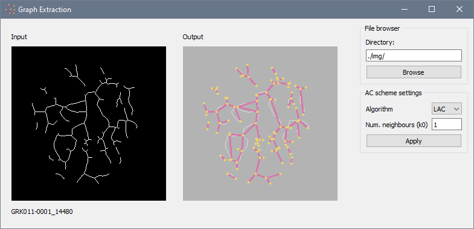

# graph-extraction-gui
A GUI to visualise an NN-based
[graph extraction procedure](http://github.com/salehahr/graph-extraction-networks)
applied to skeletonised endoscopic images.



## Usage
1. Install required packages (s. [`requirements.txt`](./requirements.txt) )  
    e.g.
    ```
    pip install -r requirements.txt
    ```  
    e.g. or in conda  
    ```
    conda env create --file requirements.txt
    ```
2. Run [`main.py`](./main.py)  
    ```
    python main.py
    ```

### Using a remote interpreter
First set some variables before running.
- Set the following environment variables (example)
    ```
    DISPLAY=localhost:10;LIBGL_ALWAYS_INDIRECT=1
    ```
- Set the corresponding display number in the GUI viewer (e.g. VcXsrv)

## Notes
- Sample skeletonised images are provided in the [`img`](./img) folder.
- The adjacency matrix is predicted using the BAC scheme.
- This GUI implementation is currently not optimised for GPU.

